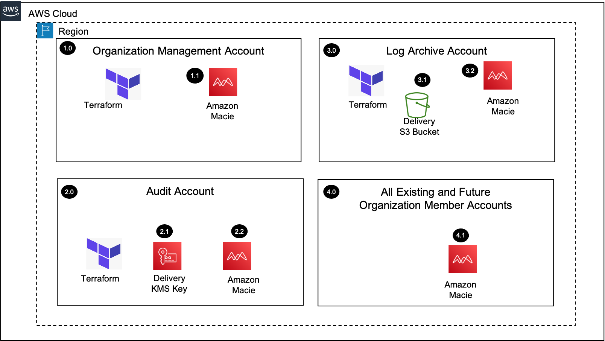

# Macie Organization


## Introduction

The Macie Organization solution will enable Amazon Macie by delegating administration to an Audit account within the Organization Management Account and configuring Macie within the delegated administrator account for all the existing and future AWS Organization accounts. Macie is also configured to send the findings to a central S3 bucket encrypted with a KMS key.

## Target Architecture



## Prerequisites

Terraform templates are available to deploy below pre-requisites with Readme document in Prerequisites directory in this repository.
 
**AUDIT ACCOUNT**

In this step , KMS key will be created in Audit account . This will be used to encrypt objects in S3 bucket which we are going to have in log archive account.

1. KMS Key creation steps in Control Tower Audit account
2. Clone the repository to local using git clone <repo URL>
3. Go to prerequisites/AUDIT folder
4. Update terrform.tfvars file with the appropriate details
5. Run terraform commands to deploy these resources in Audit account.

```
export AWS_REGION={{ REGION }}
terraform init
terraform plan
terraform apply
```

**LOG ARCHIVE ACCOUNT**

In this step, S3 bucket will be created in log archive account with the KMS key which is created in previous step.

1. S3 bucket creation steps in Control Tower Audit account
2. Clone the repository to local using git clone <repo URL>
3. Go to prerequisites/LOGARCHIVE folder
4. Update terrform.tfvars file with the appropriate details
5. Run terraform commands to deploy these resources in Audit account.
```
terraform init
terraform plan
terraform apply
```
**Organization Management Account:**

Delegate Administration to Control Tower Audit account

1. Clone the repository to local using git clone <repo URL>
2. Go to prerequisites/MANAGEMENT folder
3. Update terrform.tfvars file with the appropriate details
4. Run terraform commands to deploy these resources in Audit account.
```
terraform init
terraform plan
terraform apply
```
5. Log in to Management account and validate Macie Administration has been delegated to Audit account
6. Also validate Macie enabled on Audit account

<!-- BEGIN_TF_DOCS -->
## Requirements

No requirements.

## Providers

No providers.

## Modules

| Name | Source | Version |
|------|--------|---------|
| <a name="module_Delegation_Admin_Access"></a> [Delegation\_Admin\_Access](#module\_Delegation\_Admin\_Access) | ../../modules/delegation-access-module | n/a |

## Resources

| Name | Type |
|------|------|
| [aws_macie2_organization_admin_account.admin_account](https://registry.terraform.io/providers/hashicorp/aws/latest/docs/resources/macie2_organization_admin_account) | resource |

## Inputs

| Name | Description | Type | Default | Required |
|------|-------------|------|---------|:--------:|
| <a name="input_audit_account_id"></a> [audit\_account\_id](#input\_audit\_account\_id) | Account id which we want to delegate access | `string` | n/a | yes |

## Outputs

No outputs.
<!-- END_TF_DOCS -->

## Deployment

**Audit account:**

Macie customization in Audit Account

1. Clone the repository to local using git clone <repo URL>
2. Go to deployment folder
3. Update terrform.tfvars file with the appropriate details
4. Run terraform commands to deploy these resources in Audit account.
```
terraform init
terraform plan
terraform apply
```
5. Log in to Audit account and validate Macie is monitoring all the accounts s3 buckets and export findings configuration is in place. 
6. Also validate Auto enable is turned on

<!-- BEGIN_TF_DOCS -->
## Requirements

No requirements.

## Providers

No providers.

## Modules

| Name | Source | Version |
|------|--------|---------|
| <a name="module_Macie_customization"></a> [Macie\_customization](#module\_Macie\_customization) | ../../modules/macie-customization-module | n/a |

## Resources

| Name | Type |
|------|------|
| [aws_macie2_classification_export_configuration.macieconfiguration](https://registry.terraform.io/providers/hashicorp/aws/latest/docs/resources/macie2_classification_export_configuration) | resource |
| [aws_macie2_member.this](https://registry.terraform.io/providers/hashicorp/aws/latest/docs/resources/macie2_member) | resource |
| [null_resource.Autoenablemode](https://registry.terraform.io/providers/hashicorp/null/latest/docs/resources/resource) | resource |
| [aws_caller_identity.current](https://registry.terraform.io/providers/hashicorp/aws/latest/docs/data-sources/caller_identity) | data source |

## Inputs

| Name | Description | Type | Default | Required |
|------|-------------|------|---------|:--------:|
| <a name="input_LogArchiveAccountId"></a> [LogArchiveAccountId](#input\_LogArchiveAccountId) | Account id of LogArchiveAccount | `string` | n/a | yes |
| <a name="input_MacieOrgDeliveryKeyAlias"></a> [MacieOrgDeliveryKeyAlias](#input\_MacieOrgDeliveryKeyAlias) | kms key arn which is created part of pre-requisites | `string` | n/a | yes |
| <a name="input_ManagementAccountId"></a> [ManagementAccountId](#input\_ManagementAccountId) | Account id of ManagementAccount | `string` | n/a | yes |
| <a name="input_autoenablemode"></a> [autoenablemode](#input\_autoenablemode) | Auto enable option to enable macie automatically for new accounts | `string` | `"yes"` | no |
| <a name="input_exports3bucket"></a> [exports3bucket](#input\_exports3bucket) | Bucket name which is created part of pre-requisites | `string` | n/a | yes |
| <a name="input_member_accounts"></a> [member\_accounts](#input\_member\_accounts) | Member account lists | <pre>list(object({<br>        Accountid = string<br>        Emailaddress = string<br>  }))</pre> | n/a | yes |

## Outputs

No outputs.
<!-- END_TF_DOCS -->


## Verify Solution Deployment
1.	Log into the Management account and navigate to the Macie page 
    1. Validate that the delegated admin account is set
2.	Log into the Audit account and navigate to the Macie page 
    1.	Verify the correct Macie configurations have been applied
    2.	Verify all existing accounts have been enabled
    3.	Verify the findings export is configured for the S3 bucket
    4.	Generate sample findings to verify S3 delivery
3.	Log into the Log archive account and navigate to the S3 page 
    1.	Verify the sample findings have been delivered


## Security

See [CONTRIBUTING](CONTRIBUTING.md#security-issue-notifications) for more information.

## License

This library is licensed under the MIT-0 License. See the LICENSE file.
